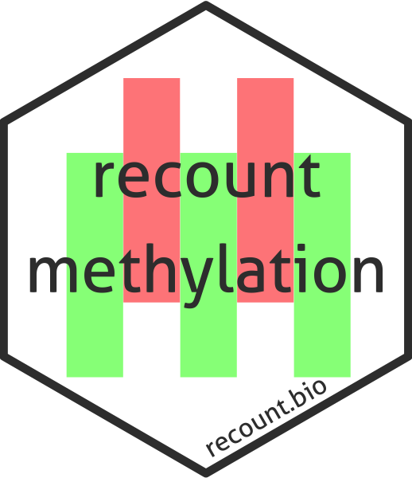

# `recountmethylation` [](https://recount.bio/data)

# Authors

Sean K. Maden, Kasper D. Hansen, Abhi Nellore

# Installation and data access

Install this library from an R session using 
`require(devtools); install_github("metamaden/recountmethylation")`.

# Package disclaimer

```
***************************************

recountmethylation

* VERSION:
0.01.0

* DISCLAIMER:

Recount Methylation contains data from GEO 
(ncbi.nlm.nih.gov/geo/), a live public 
database where alterations to online records 
can cause discrepancies with stored data 
over time. We cannot gaurantee the accuracy 
of data in Recount Methylation and advise 
users cross-check their findings with 
latest available records.


* CITATION:

If you use this package in published research, 
please cite the accompanying manuscript.

***************************************
```
