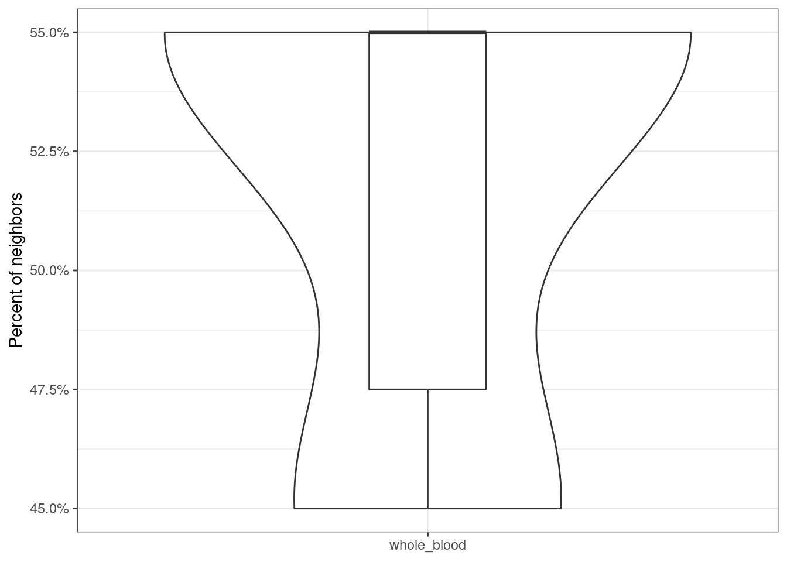
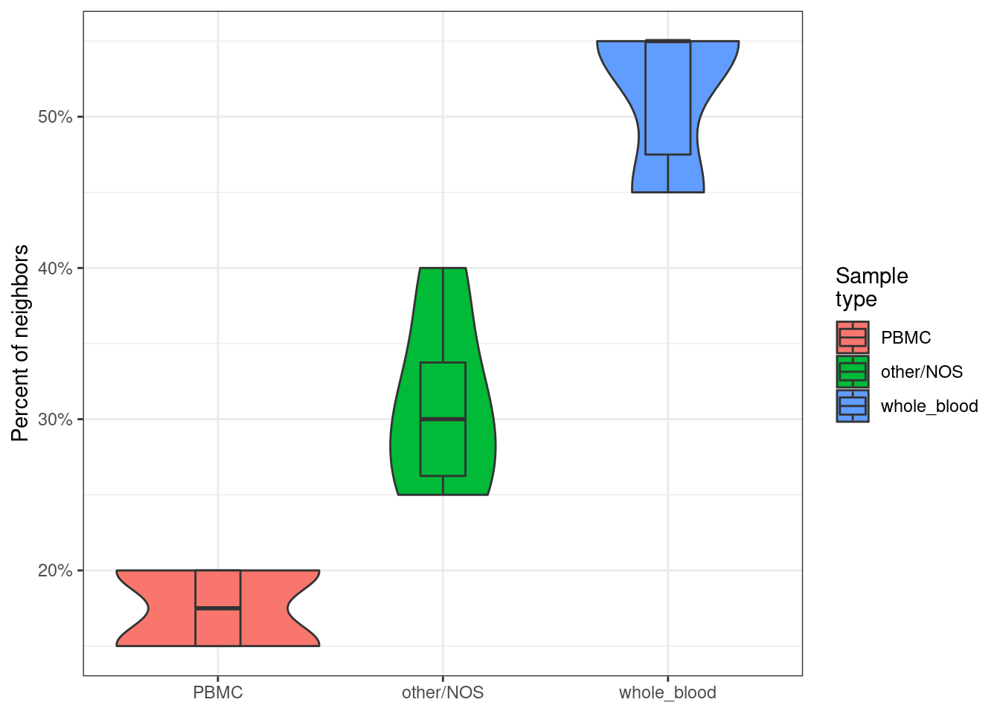

```{r chunk_settings, eval = T, echo = F, warning = F, message = F}
library(recountmethylation)
library(basilisk)
library(reticulate)
library(HDF5Array)
library(ggplot2)
knitr::opts_chunk$set(eval = FALSE, echo = TRUE, warning = FALSE, message = FALSE)
```

```{r setup, echo = F}
si.dpath <- system.file("extdata", "sitest", package = "recountmethylation")
# get object paths
bval.fpath <- file.path(si.dpath, "bval_100.csv")
fhtable.fpath <- file.path(si.dpath, "bval_100_fh10.csv")
md.fpath <- file.path(si.dpath, "mdf_sitest.rda")
# load objects
bval <- read.csv(bval.fpath)
fhtable <- read.csv(fhtable.fpath)
md <- get(load(md.fpath))
```

This vignette provides instructions to construct and analyze a search index of DNAm array data. The index is made using the `hnswlib` Python library, and the `basilisk` and `reticulate` R/Bioconductor libraries are used to manage Python environments and functions. These methods should be widely usedful for genomics and epigenomics analyses, especially for very large datasets.

# Background: search indexes for biological data

The search index has a similar function to the index of a book. Rather than storing the full/uncompressed data, only the between-entity relations are stored, which enables rapid entity lookup and nearest neighbors analysis while keeping stored file sizes manageable. Many methods for search index construction are available. The Hierarchical Navigable Small World (HNSW) graph method, used below, is fairly new (@malkov_efficient_2018) and was among the overall top performing methods benchmarked in [ANN benchmarks](https://github.com/erikbern/ann-benchmarks) (@aumuller_ann-benchmarks_2018). HNSW is implemented by the `hnswlib` Python library, which also includes helpful docstrings and a ReadMe to apply the method in practice.

 While prior work showed the utility of indexing several types of biomedical data for research, to our knowledge this is the first time support has been provided for R users to make and analyze search indexes of DNAm array data. This vignette walks through a small example using a handful DNAm array samples from blood. Interested users can further access a comprehensive [index]("https://recount.bio/data/sidict-hnsw__bval-gseadj-fh10k__all-blood-2-platforms.pickle") of pre-compiled DNAm array data from blood samples on the [`recountmethylation` server](https://recount.bio/data/). These data were available in the Gene Expression Omnibus (GEO) by March 31, 2021, and they include 13,835 samples run on either the HM450K or EPIC platform.

# Index samples on dimension-reduced data

Make a new search index using sample DNAm array data after performing dimensionality reduction on the data using feature hashing (a.k.a. "the hashing trick", @weinberger_feature_2010).

## Virtual environment setup

First, use the `setup_sienv()` function to set up a Python virtual environment named "dnam_si_vignette" which contains the required dependencies. Since this function and other related functions are not exported, use `:::` to call it. 

For greater reproducibility, specify exact dependency versions e.g. like "numpy==1.20.1". Install the `hnswlib` (v0.5.1) library to manage search index construction and access. install `pandas` (v1.2.2) and `numpy` (v1.20.1) for data manipulations, and `mmh3` (v3.0.0) for feature hashing. Note certain packages, including `hnswlib`, may only be available in conda repositories for certain operating systems.

```{r}
recountmethylation:::setup_sienv(env.name = "dnam_si_vignette")
```

## Perform dimensionality reduction on DNAm data

Search index efficiency pairs well with dimensionality reduction to enable very rapid queries on large datasets. This section shows how to reduce a dataset of DNAm fractions prior to indexing. 

First, save the DNAm fractions (Beta-values) from a `SummarizedExperiment` object, ensuring sample data is in rows and probes are in columns. First, access the DNAm locally from the object `gr-noob_h5se_hm450k-epic-merge_0-0-3`, which is available for download from `recount.bio/data`. Next, identify samples of interest from the sample metadata, which is accessed using `colData()`. After subsetting the samples, store the DNAm fractions (a.k.a. ``Beta-values'') for 100 CpG probes, which we access using `getBeta()`.

First, load the `h5se` object.

```{r}
gr.fname <- "gr-noob_h5se_hm450k-epic-merge_0-0-3"
gr <- HDF5Array::loadHDF5SummarizedExperiment(gr.fname)
md <- as.data.frame(colData(gr)) # get sample metadata
```

Next, identify samples from study GSE67393 (@inoshita_sex_2015) using the sample metadata object `md`.

```{r}
# identify samples from metadata
gseid <- "GSE67393"
gsmv <- md[md$gse == gseid,]$gsm # get study samples
gsmv <- gsmv[sample(length(gsmv), 10)]
```

For this vignette, select a random subset of whole blood and PBMC samples to analyze. Identify these using the "blood.subgroup" column in `md`.

```{r}
# get random samples by group label
set.seed(1)
mdf <- md[md$blood.subgroup=="PBMC",]
gsmv <- c(gsmv, mdf[sample(nrow(mdf), 20),]$gsm)
mdf <- md[md$blood.subgroup=="whole_blood",]
gsmv <- c(gsmv, mdf[sample(nrow(mdf), 20),]$gsm)
```

For the specified samples of interest, extract DNAm Beta-value fractions for a subset of 100 probes.

```{r}
# norm bvals for probe subset
num.cg <- 100
grf <- gr[,gr$gsm %in% gsmv]; dim(grf)
bval <- getBeta(grf[sample(nrow(grf), num.cg),])
bval <- t(bval) # get transpose
rownames(bval) <- gsub("\\..*", "", rownames(bval)) # format rownames
```

This produced a DNAm matrix of 50 samples by 100 probes, which we'll save.

```{r}
# save bval table
bval.fpath <- paste0("bval_",num.cg,".csv")
write.csv(bval, file = bval.fpath) 
```

Call `get_fh()` to perform feature hashing on the DNAm data. Feature hashing is a dimensionality reduction technique, which here means that it reduces the dataset features/columns (or probes in this case) while preserving beween-sample variances. 

Specify the target dimensions for this step using the `ndim` argument. For this small example, reduce the DNAm matrix to about 10% of its original size by setting the target dimensions to 10 (e.g. use `ndim = 10`).

```{r}
# get example table and labels
num.dim <- 10 # target reduced dimensions
fhtable.fpath <- "bval_100_fh10.csv"
recountmethylation:::get_fh(csv_savepath = fhtable.fpath, 
                            csv_openpath = bval.fpath, 
                            ndim = num.dim)
```

If `ndim` is high, the data is less reduced/compressed but more closely resembles the original uncompressed data, while the opposite is true at lower `ndim`. The exact target dimensions to ultimately use is up to user discretion. In practice, 10,000 dimensions yields a good tradeoff between compression and uncompressed data simliarity for HM450K arrays.

## Make a new HNSW search index

Use `make_si()` to make a new search index. This function calls the `hnswlib` Python package to make a new search index and dictionary using the hashed features file generated above. The resulting search index file has the extension `*.pickle`, since the `pickle` Python library is used to compress the search index binary. 

```{r}
# set file paths
si.fname.str <- "new_search_index"
si.fpath <- file.path(si.dpath, paste0(si.fname.str, ".pickle"))
sidict.fpath <- file.path(si.dpath, paste0(si.fname.str, "_dict.pickle"))
# make the new search index
recountmethylation:::make_si(fh_csv_fpath = fhtable.fpath, 
                             si_fname = si.fpath, 
                             si_dict_fname = sidict.fpath)
```

The tuning parameters `space_val`, `efc_val`, `m_val`, and `ef_val` were selected to work well for DNAm array data, and further details about these parameters can be found in the `hnswlib` package docstrings and ReadMe.

# Query nearest neighbors in the search index

Analyze nearest neighbors returned from a series of queries varying the k number of nearest neighbors from 1 to 20. 

## Get nearest neighbors from search index queries

Specify a vector of valid GSM IDs which can be found in the hashed features table `bval_100_fh10.csv` as well as the saved search index `new_search_index.pickle` and dictionary `new_search_index_dictionary.pickle`.

```{r}
query.gsmv <- c("GSM1506297", "GSM1646161", "GSM1646175", "GSM1649753", "GSM1649758", "GSM1649762")
```

Specify the vector `lkval` containing the k numbers of nearest neighbors to return in each query. 

Certain query constraints are determined by the seach index properites. First, if each record in a search index includes 100 features (e.g. probes, hashed features, etc.), then queries should include exactly 100 dimensions per queried sample, in the same order as the search index. This is why it is convenient to use the previously compiled hashed features table for queries. Further, the k nearest neighbors to return cannot exceed the total indexed entities, or 50 in this example.

```{r}
lkval <- c(1, 5, 10, 20) # vector of query k values 
```

Use `query_si()` to run the query. The path to the hashed feature table `bval_100_fh10.csv` is specified, which is where sample data are accessed for each query.

```{r}
si_fpath <- system.file("extdata", "sitest", package = "recountmethylation")
dfnn <- recountmethylation:::query_si(sample_idv = query.gsmv, 
                                      fh_csv_fpath = fhtable.fpath,
                                      si_fname = "new_search_index",
                                      si_fpath = si_fpath,
                                      lkval = lkval)
```


## Inspect query results

The query results were assigned to `dfnn`, which we can now inspect. First show its dimensions.

```{r}
dim(dfnn)
```

`dfnn` has 10 rows, corresponding to the 10 queried sample IDs, and 5 columns. The first column shows the IDs for the queried samples. Columns 2-5 show the results of individual queries, where column names designate the k value for a query as `k=...`.

```{r}
colnames(dfnn)
```

Now consider the query results for the sample in the first row, called "GSM1646161.1607013450.hlink.GSM1646161_9611518054_R01C01". Check the results of the first 3 queries for this sample (k = 1, 5, or 10).

```{r}
unlist(strsplit(dfnn[1,"k=1"], ";"))
```

When k = 1, the sample ID is returned. This is because the query uses the same hashed features data as was used to make the search index, and the search is for a subset of the indexed samples. 

```{r}
unlist(strsplit(dfnn[1,"k=5"], ";"))
```

This shows that samples are returned in the order of descending similarity to the queried data. For k = 5, the first sample returned is the same as k = 1, followed by the next 4 nearest neighboring samples.

```{r}
unlist(strsplit(dfnn[1,"k=10"], ";"))
```

For k = 10, the first 5 neighbors are the same as for k = 5, followed by the next 5 nearest neighbors.

# Plot metadata labels among nearest neighbors

This section shows some ways to visualize the results of nearest neighbors queries using the `ggplot2` package.

## Metadata label frequency among neighbors from a single query

Now analyze the type of samples among returned nearest neighbors. Use the `md` object to map labels to returned sample IDs for a single query, e.g. the first row where k = 5.

```{r}
gsmvi <- unlist(strsplit(dfnn[1, "k=5"], ";"))
blood.typev <- md[gsmvi,]$blood.subgroup
```

We see there are 4 whole blood samples, and 1 labeled other/NOS which corresponds to the label for the queried sample.

## Distribution of neighbors labeled whole blood across queries

Now get the distribution of labels across samples for a single k value. We'll show the distribution of samples with the label "whole_blood" from the variable "blood.subgroup", focusing on nearest neighbors returned from the first query with k = 20.

```{r}
dist.wb <- unlist(lapply(seq(nrow(dfnn)), function(ii){
  gsmvi <- unlist(strsplit(dfnn[ii,"k=20"], ";"))
  length(which(md[gsmvi,]$blood.subgroup=="whole_blood"))
}))
```

Now plot the results for whole blood after formatting the results variables. Use a composite violin plot and boxplot to show the results scaled as percentages on the y-axis, including important distribution features such as the median, interquantile range, and outliers.

```{r}
dfp <- data.frame(num.samples = dist.wb)
dfp$perc.samples <- 100*dfp$num.samples/20
dfp$type <- "whole_blood"
ggplot(dfp, aes(x = type, y = perc.samples)) + 
  geom_violin() + geom_boxplot(width = 0.2) + theme_bw() +
  ylab("Percent of neighbors") + theme(axis.title.x = element_blank()) +
  scale_y_continuous(labels = scales::percent_format(scale = 1))
```



# Distributions of multiple labels and queries

Repeat the above for all three mapped metadata labels. Define a function `get_dfgrp()` to calculate the number of neighbors having each metadata label. This function takes the metadata object `md` as a first argument, and the vector of metadata labels `ugroupv` as the second argument. 

For `ugroupv`, specify the three metadata labels of interest identifiable under the `blood.subgroup` column in `md` (e.g. "whole_blood", "PBMC", "other/NOS"). 

```{r}
# function to get samples by label
get_dfgrp <- function(md, ugroupv = c("whole_blood", "PBMC", "other/NOS")){
  do.call(rbind, lapply(c("whole_blood", "PBMC", "other/NOS"), function(ugroupi){
    num.grp <- length(which(md[ugroupv,]$blood.subgroup==ugroupi))
    data.frame(num.samples = num.grp, type = ugroupi)
  }))
}
```

For each queried sample, use `get_dfgrp()` to calculate frequencies for metadata labels specified in `ugroupv`. Assign the results to `dfp`.

```{r}
# get samples by label across queries
dfp <- do.call(rbind, lapply(seq(nrow(dfnn)), function(ii){
  get_dfgrp(md = md, unlist(strsplit(dfnn[ii,"k=20"], ";")))
}))
```

Format `dfp`'s variables for plotting, then make the composite violin and boxplots. This will show the three label distributions across queries. The metadata labels will be ordered according to their distribution medians, and the y-axis will reflect the percent of neighbors containing each label.

```{r}
# format dfp variables for plots
dfp$perc.samples <- 100*dfp$num.samples/20
# reorder on medians
medianv <- unlist(lapply(c("whole_blood", "PBMC", "other/NOS"), function(groupi){
  median(dfp[dfp$type==groupi,]$perc.samples)}))
# define legend groups
dfp$`Sample\ntype` <- factor(dfp$type, levels = c("whole_blood", "PBMC", "other/NOS")[order(medianv)])
```

Generate composite violin plots and boxplots for each metadata label.

```{r}
# make new composite plot
ggplot(dfp, aes(x = `Sample\ntype`, y = perc.samples, fill = `Sample\ntype`)) + 
  geom_violin() + geom_boxplot(width = 0.2) + theme_bw() +
  ylab("Percent of neighbors") + theme(axis.title.x = element_blank()) +
  scale_y_continuous(labels = scales::percent_format(scale = 1))
```



# Session Info

```{r, eval = T}
utils::sessionInfo()
```

# Works Cited

